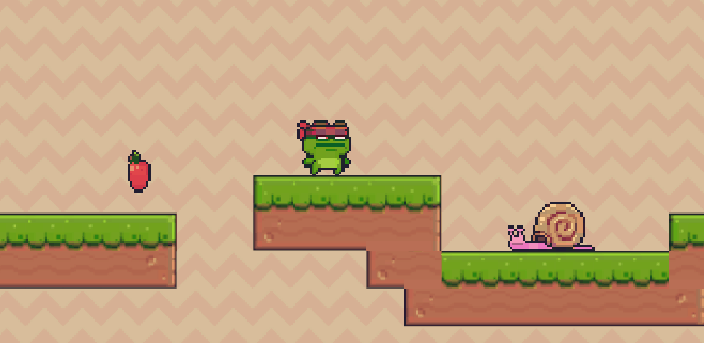

# TutorialPlatformer2D  
Code and Assets for a Simple Platformer Demo in Unity for a Tutorial  

This requires a project to be created with the 2D game template.  

Project is now available as Unity Package file, upgraded for Unity 2021.3, available in releases: https://github.com/Wally869/TutorialPlatformer2D/releases/tag/Package  

I made this playable demo to showcase the instructions outlined in my tutorial serie: How to Make a 2D Platformer in Unity. I wanted to make a simple and comprehensive introduction to creating games with Unity with code, explanation and assets available to everyone.  

FEATURES:  
- Player Controller for movement and animation  
- Patrolling Monster  
- End Game Target    
- Level Creation with Tilemaps  
  
A lot of other introductory stuff presented in a simple and approachable manner!    

Visit my website to get the tutorial and explanations for the code: https://www.noveltech.dev/work/tutorial-platformer-2d-unity/  

The Playable demo is available on itch: https://wally869.itch.io/tutorialplatformer2d  

Credits:

PixelFrog for his great, free characters, tilesets... Get them here: https://pixel-frog.itch.io/pixel-adventure-1  
